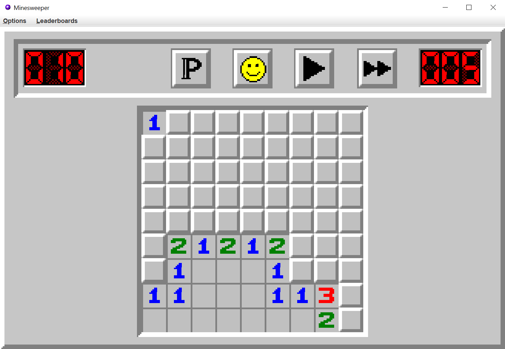
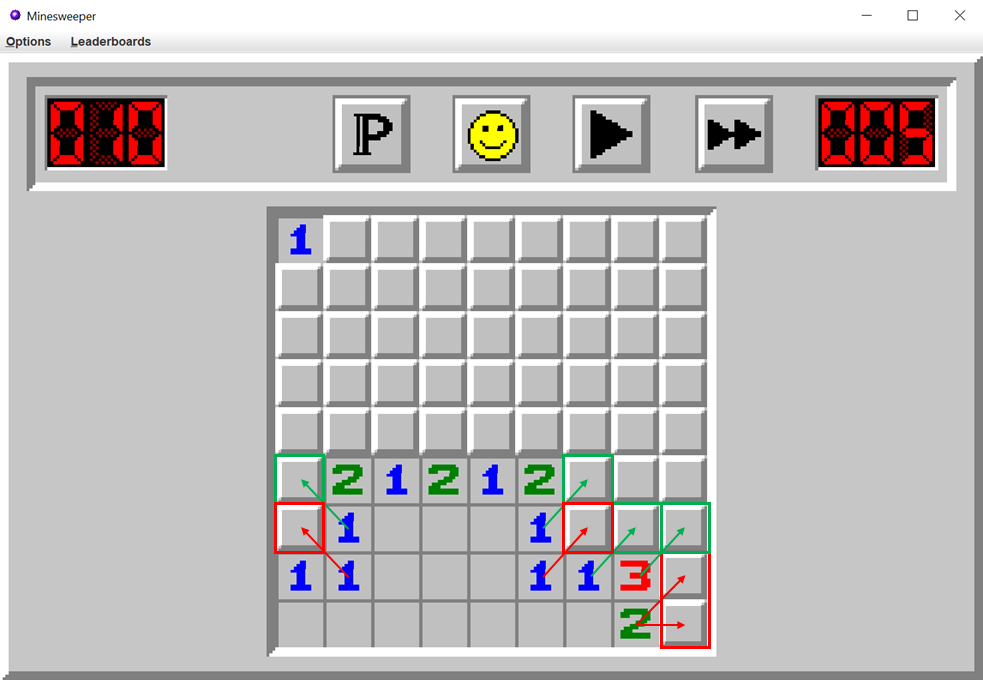
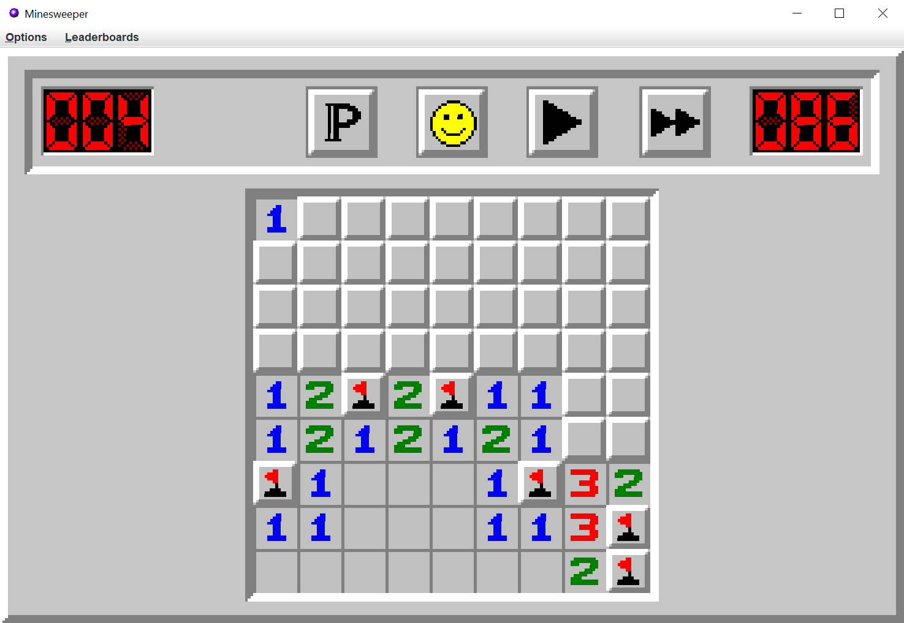
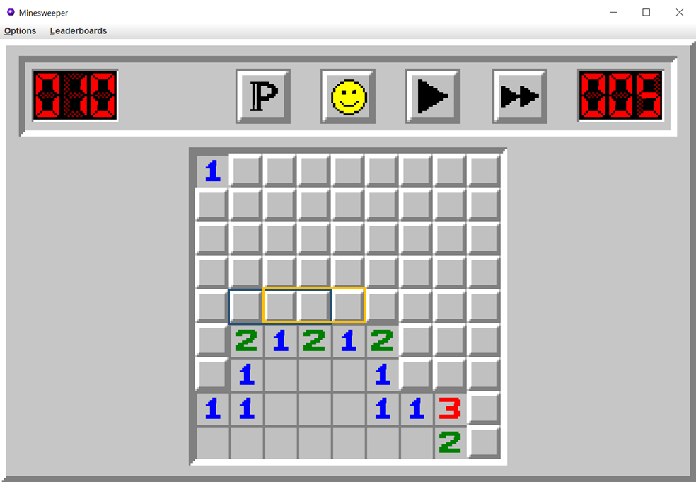
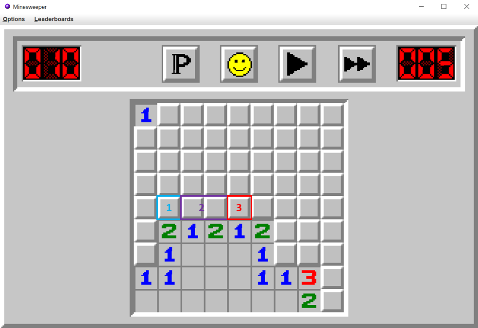

# How the solver works

The Solver is used when playing in automatic mode, i.e. in Step by step mode or in Let it play mode. Its role is to find out which tiles to click to continue the game, by guaranteeing the highest win-rate.

It can operate on 3 different ways, depending on the current state of the game.

## Beginning of the game

At the beginning of the game, since we have almost no information on the mines, we have no other choice but to click the tiles and hope we don't fall into a mine. We have to do this until we fall into a tile that has a value of 0 (i.e. that has no mined neighbors), because then, several other tiles will be uncovered as well and we will get much more information.

The best startegy is to click tiles by beginning with the corners, since these tiles have only 3 neighbors, and hence have much more chances of having a value of 0.

Once all the corners are clicked, if we didn't get a 0 yet, we continue by clicking on the borders, which tiles have only 5 neighbors.

The solver searches the best tile on the border to click, which is the furthest from the tiles already clicked, i.e. the tile that requires the most moves (N-S-E-W or diagonal) to go to an uncovered tile.

Unfortunately a few games are lost during this stage, with a proportion depending on the difficulty:
* Beginner: Around 5% of the games
* Intermediate: Around 9% of the games
* Expert: Around 17% of the games
* Demon: Around 22% of the games

## During the game

Once a 0-tile has been found, the first stage is over and the solver will now use the informations given by the tiles to progress through the game. The goal will be to progressively uncover the tiles, by minimzing the probability of dying.

To do so, the solver can operate in two ways:
* Look for tiles it can be sure are safe or mined
* If it doesn't find such tiles, compute the probability that each tile has to be a mine, and choose the one that has the lowest one.

### Finding certain tiles

First, the solver tries to find tiles which nature can be determined in a certain way. Let's understand how he proceeds by looking at the following example:

<figure class="image">
  

    
  

  <figcaption> 
How certain tiles are found
 </figcaption>
</figure>

First of all, we can use two very basic rules to find tiles:
* If a tile has the same number of unknown mines as the number of unknown neighbors, then all of its unknown negihbors must be mines.
* If a tile has the same number of neighbor mines as the number of flagged-neighbors, then all its remaining neighbors must be safe.

With these two rules, we can deduce some tiles on our example, as can be seen on the image below: the red arrows correspond to the first rule, and the green arrows correspond to the second rule.

<figure class="image">
  

    
  

  <figcaption> 
First method for determining certain tiles
 </figcaption>
</figure>

However, there are a few more tiles to be found in the example, which are a bit less obvious than the previous ones.

On the below image, the tiles' values learn us that there is only one mine in the blue rectangle, and two in the yellow rectangle. This means that there has to be one mine in the right tile of the yellow rectangle, no mine the left tile of the blue rectangle, and one mine in the two tiles that are common to the two groups. We can therefore deduce the nature of two supplementary tiles.

<figure class="image">
  

    
  

  <figcaption> 
Finding tiles by grouping them
 </figcaption>
</figure>

We can apply the same rules for all the remaining tiles, and get the following result:

<figure class="image">
  

    
  

  <figcaption> 
Safe and mined tiles deduced
 </figcaption>
</figure>

To compute all the certain tiles, the solver implements the two previous ideas by creating groups of tiles, and computing lower and upper bounds for the number of mines each group of tiles contains. To do so, it proceeds this way: 

* For each tile that has at least one unknown neighbor, it defines the group containing all of its unknown neighbors. This group has the same number of mines as the number of unknown mines around the tile.
* It "divides" these groups into smaller groups, by the process described in the image below:

<figure class="image">
  

    
     
  

  <figcaption> 
Groups before and after division
 </figcaption>
</figure>

The first group contains the tiles that are only in the blue group. The third group contains the tiles that are only in the yellow one. The second group contains the tiles that are in both groups. The solver then deduces lower and upper bounds for the number of mines of each of the three groups created (see SeparateTwoTileGroups method of MinesweeperSolver class for precise formulas). It is also important to note that the two original groups are kept, because they contain supplementary information.

* It keeps dividing all the groups, until no more groups are created AND no supplementary information is added concerning the number of mines of each group.

Once all the groups have been computed, the solver deduces the tiles that are certain to be safe or mined, using the two following rules:
* If a given group has no mines, then it means that all of its tiles are safe. 
* If a group has the same numbers of tiles as of mines, it means that all of its tiles are mines.

### Computing probabilities

In some cases, it can happen that the previous computations give no solution. In this case, the solver will have no other choice than to guess a tile, by minimizing the probability of falling into a mine. To do so, the solver will look at all the unknown tiles that have a uncovered neighbor (that we will refer to as "candidate tiles" in what follows), and compute every possible disposition on mines on these tiles that can satisfy the constraints imposed by the tiles.

Then, for each of these tiles, it will count the number of such possibilities where this tile has a mine, and divide it by the total number of possibilities.

To do this, the solver uses a recursive function. There are two base cases:

- If there are no candidate tiles, then there is only one solution.

- If there is only one group of tiles, then we can give an explicit formula for the total number of dispositions, and for the total number of dispositions where a given tile has a mine. Let's call $M$ the number of mines in the group, and $N$ the number of its tiles. Then :
* The total number of possibilities is $\displaystyle {N \choose M}$
* For each tile, the total number of possibilities where this tile has a mine is $\displaystyle {N-1 \choose M-1}$

On the following example, we have $\displaystyle {8 \choose 3}$ possibilities in total, and for each tile, $\displaystyle {7 \choose 2}$ possibilities where it is a mine. 

Now, in the general case, the solver will act recursively: 
* Among all of its groups, the solver will choose one group and enumerate all of its possibile mine dispositions.
* For each one of its dispositions, it will call itself to compute the number of possibilities.
* It will add all of the possibilities

On the following example, we can visualise the two different dispositions the solver will try:

It is important to note here that the group chosen in this step is crucial if we want to get a reasonable computation time. To make sure of that, we will chose the group depending on two points:
* The chosen group must have a number of possible dispositions as small as possible.
* Each of its disposition, must permitt to uncover as much of the board as possible, to reduce the number of possibilities that will be computed.
 

As it is, the solver does compute all the possibilities as we need. However, it oftenly happens that the candidate tiles have several "connected components", in the sense that it can have several sub-groups that are independent with each-other, like on the following example:

In such a case, the total number of possibilities can be computed as the product between the number of possibilities for each connected component, and can therefore by extremely large if we have several connected components, so computing all the possibilities one by one would be impossible. The solution, in such a case, is to compute the possibilities for each connected component separately, and then all of the possibilities, which gives a much more reasonable execution time.

### Computing probabilities - refinement
