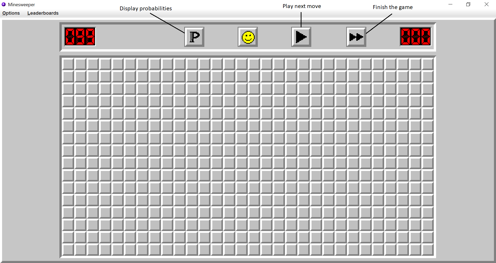

# Minesweeper_with_Help_and_Automatic_Modes
Here is a Minesweeper game I created using Java.

The game has been implemented using the awt and swing libraries for the graphics. For the rules, I used the rules from https://minesweeper.online/

I also added four game modes that I created myself to make the game more diverse.

## How to play

Minesweeper is a logic puzzle game where we have a rectangle board with tiles, a given number of them being a mine. The goal of the game is to discover which tiles have a mine and which tiles don't.

<figure class="image">
  

    
  

  <figcaption> 
9x9 board with 10 mines
 </figcaption>
</figure>

To complete the game, we have the following rules:

- When we left-click a tile, if it is "safe" (i.e. if it doesn't contain a mine), a number is displayed that corresponds to the number of neighbor tiles (diagonal tiles included) that have a mine. There are at most 8 such tiles, so the number that will be displayed will be between 0 and 8. 

<figure class="image">
  

    
  

  <figcaption> 
Only one neighbor of the tile clicked has a mine
 </figcaption>
</figure>

- When we think a tile has a mine, we can right-click on it, which sets a flag on it and marks it as "mined" for the rest of the game. For example, in the following image, the top-left tile has two neighbor tiles, and one of its three neighbors is already uncovered, so the two other tiles must have a mine.

<figure class="image">
  

    
  

  <figcaption> 
Example of right click
 </figcaption>
</figure>

Using the informations we get at each click, the goal of the game is to uncover all the "safe" tiles. We lose if we left-click a mined tile.  
 

There are two more rules that permit to play the game faster and easier:

- When a player clicks a tile that has no neighbor mine, then the tile is just displayed as "empty", and all the neighboring tiles are displayed as well. This process is also repeated for all of the neighbors, and so on, until no more empty tiles are found. 

For example, in the image below, we clicked the central tile which turned out to have no neighbor mines, and a whole zone around it has been uncovered.

<figure class="image">
  

    
  

  <figcaption> 
Example of what happens when clicking an empty tile
 </figcaption>
</figure>

- Finally, a player can "chord" a tile that is already uncovered, which means he can click it at the condition that the number it has corresponds to the number of neighbor tiles that have a flag. Then, all the un-flagged neighbor tiles will be uncovered. If the flags are not set correctly, then we will uncover a mine, and hence lose.

In the following example below, we chord the tile surrounded by 2 flags, which permits to uncover its 2 neighbors.

<figure class="image">
  

    
     
  

  <figcaption> 
Chording a tile 
 </figcaption>
</figure>

Minesweeper has 3 difficulties:
- Beginner, where the board has dimensions 9 x 9 and 10 mines
- Intermediate, where the board has dimensions 16 x 16 and 40 mines
- Expert, where the board has dimensions 30 x 16 and 99 mines

The player can also define a "custom" board, in which he can define the board's dimensions and the number of mines.

In my game, I also added a fourth difficulty, that I called demon, where the board has dimensions 75 x 35 and 600 mines. The number of mines is so big that it is almost impossible for a player to complete it without losing, so if you want to play it, I strongly recommend playing it using unblocker mode (see below).

One of the main challenges in Minesweeper is to finish the game as fast as possible, so I added a leaderboard for each difficulty. This adds more interest to the game, since the player will constantly have the goal to improve the times he already made for each difficulty. I will now present the 4 different game modes I added to the game. When playing these game modes, the times will not be stored in the leaderboard, except if we play demon with "unblocker mode".

## The game modes

In the two first game modes, as the player plays the game, the program gives him help by marked some tiles as "flagged".

### Unblocker mode

When playing minesweeper, most of the time, we find tiles to click, be it left-clicks or right-clicks. However, it can sometimes happen that we can't find such moves and, instead, have to guess randomly which tile to click, and failing because of this can be pretty frustrating, especially when we almost finished the game. In this mode, when the player does a move, the program checks if there are solutions that can be found, and if there are not, it helps the player by displaying one mine, so he can keep going. Between all the mines that are left, the one that is displayed is the one that allows the player to deduce the most tiles to make sure it helps him as most as possible.

In the following example, it is impossible for the player to find a move without having to guess, so the program gives him a help flag (in yellow) so he can continue. The flag is chosen so the player can then deduce the most tiles.

<figure class="image">
  

    
     
  

  <figcaption> 
Unblocking the player
 </figcaption>
</figure>

### Help mode

In this mode, when the player is blocked, he can ask the program for help, i.e. to display a mine to help him. In the same way as before, the mine displayed is the one that will help him deduce the biggest number of tiles. The number of help mines the player can ask depends on the difficulty of the game. 
This game mode can be very useful for beginners learning the game, as well as for experimented players who want to train playing in very difficult games. The example below shows an example where the player asked for help.

<figure class="image">
  

    
     
  

  <figcaption> 
Helping the player
 </figcaption>
</figure>

### Automatic modes:

In the two following mods, it is not the player that plays, but a bot, in a way such as the win rate is maximum.

The bot can mainly do two things:
* Find out which tiles we can be sure to be safe/mined.
* If no tile can be determined in a certain way, find out the probability that each tile has to be a mine, and click on the tile that has the smallest one.

#### Step by step mode

In this mode, we can follow what the bot does step by step. The player can't click on the tiles, but instead has three buttons he can click:
* "Next step": The bot will analyze the current game, and deduce which tiles he clicks to continue the game
* "Finish game": The bot will repeat the previous step until the game is finished.
* "Display probabilities": The bot will compute the probability for each mine to be a tile, and display it on the board. Very useful for understanding how the bot plays, or elaborating strategies for playing the game.

<figure class="image">
  

    
  

  <figcaption> 
Step by step mode
 </figcaption>
</figure>

<figure class="image">
  

    
  

  <figcaption> 
Displaying probabilities for each tile to be a mine
 </figcaption>
</figure>

#### Let it play mode

In this mode, the user defines a board's dimension and a number of mines (be it with "classical" difficulties, or with custom mode), and a number of games that will be played by the bot. The bot then plays all these games, and returns the number of games that have been won.
We can see what it looks like in the images below:

<figure class="image">
  

    
     
  

  <figcaption> 
Bot playing 5000 games in expert difficulty 
 </figcaption>
</figure>

Thanks to the precision of the computation of the probabilities, the win-rates of my bot are very good, and are actually better than the majority of the win-rates of the bots that can be found online. These win-rates are the following:
* Beginner difficulty: around 91%
* Intermediate difficulty: around 77%
* Expert difficulty: around 37%
* Demon difficulty: a bit more than 4%
