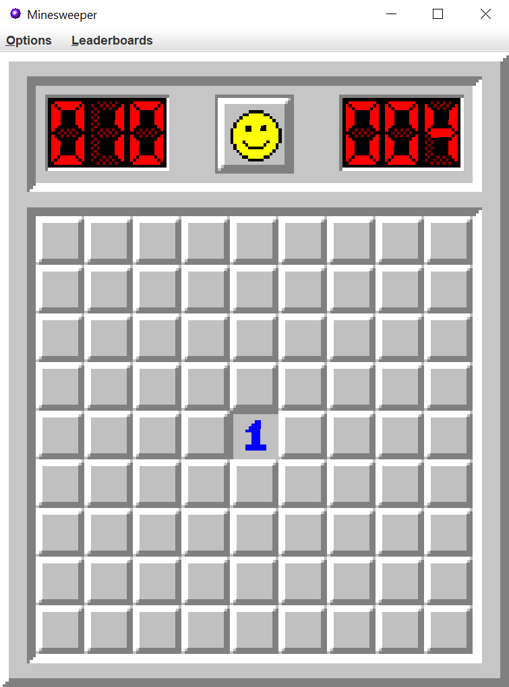

# Minesweeper_with_Help_and_Automatic_Modes
Here is a Minesweeper game I created using Java.

The game has been implemented using the awt and swing libraries for the graphics, and the rules from https://minesweeper.online/

I also added four game modes that I created myself to make the game more diverse.

## How to play

Minesweeper is a logic puzzle game where we have a rectangle board with tiles, with a certain number of them being a mine. The goal of the game is to discover which tiles have a mine. To do so, we have the following rules:

- When we left-click a tile, if it is "safe" (i.e. it doesn't contain a mine), a number is displayed that correspond to the number of neighbor tiles (diagonal tiles included) that have a mine. There are at most 8 such tiles, so the number that will be displayed will be between 0 and 8.

For example, in the image below, there is one mined tile around the center tile.

- When we think a tile has a mine, we can right-click on it, which sets a flag on it and marks it as "mined" for the rest of the game. 

For example, in the image below, the top-left tile has two neighbor tiles, so they have to be its two uncovered tiles.

Using the informations we get at each click, the goal of the game is to uncover all the "safe" tiles. We lose if we left-click a mined tile.

There are two more rules that speed-up the game:

- When a player clicks a tile that has no neighbor mine, then the tile is just displayed as "empty", and all the neighboring tiles are displayed as well. This process is also repeated for all of the neighbors, until there are no more empty tiles.

For example, in the image below, we clicked the central tile and it turned out to have no neighbor mines, and the above process has been repeated, which gave this disposition.

- Finally, a player can "chord" a tile that is already uncovered, which means he can click it at the condition that the number it has correspond to the number of neighbor tiles that have a flag. Then, all the un-flagged neighbor tiles will be uncovered. If the flags are not set correctly, then we will uncover a mine, and hence lose.

For example, in the image below, we can click the bottom 1, and uncover its 4 neighbors.

Minesweeper has 3 difficulties:
- Begginer, with a board of dimensions 9 x 9 and 10 mines
- Intermediate, with a board of dimensions 16 x 16 and 40 mines
- Expert, with a board of dimensions 30 x 16 and 99 mines
In my game, I also added a fourth difficulty that I called demon, with a board of 75 x 35 and 600 mines. The number of mines is so important that it is almost impossible for a player to complete it without losing, so if you want to play it, I strongly recommend playing it using unblocker mode (see below). I mainly used this difficulty to test computer performances on large and hard games.

In minesweeper, the player can also define a "custom" board, in which he can define the board's dimensions and the number of mines.

Once we learned the basics of the game, one of the main challenges in Minesweeper is to finish the game as fast as possible, so I added leaderboards to retain the best times for each difficulty. For a game to be saved in the leaderboard, we must play it without any of the game modes presented below, the only exception being the demon difficulty with "unblocker mode".

## The game modes

To add more originality to my game, I added 4 game modes, that will be presented in this section.

### Unblocker mode

When playing minesweeper, most of the time, we find tiles to click, be it left-clicks or right-clicks. However, it can sometimes happen that we can't find such moves and, instead, we have to guess which tile is safe, which can be pretty frustrating, especially when we almost finished the board. In this mode, as the player completes the board, the program checks if there are solutions that can be found, and if there are not, it helps the player by displaying one mine, so he can keep going. Between all the mines that are left, the one that is displayed is the one that allows the player to deduce the most tiles, so he can keep playing as long as possible.

[ AJOUTER IMAGE AVEC COMMENTAIRE]

### Help mode

In this mode, when the player is blocked, he can ask the program for help, i.e. to display a mine to help him. In the same way as before, the mine displayed is the one that will help him deduce the biggest number of tiles.
This game mode can be very useful for beginners learning the game, as well as for experimented players who want to play with high difficulty to train (be it in expert, demon difficulties, but also with custom games with a very big number of tiles or mines).

[ AJOUTER IMAGE AVEC COMMENTAIRE]

### Automatic modes:

In these two mods, it's not the player who plays, but the program.

#### Step by step mode

This mode permits to understand what the program does, and possibly to learn some strategies. The player can't click on the tiles, but instead has three buttons to click:
- "Next step": The bot will analyse the current game, and deduce which tiles he clicks to continue the game
- "Finish game": The bot will repeat the previous step until the game is finished.
- "Display probabilities": The bot will compute the probability for each mine to be a tile, and display it on the board. Very useful for understanding how the bot plays.

[ AJOUTER IMAGE AVEC FLECHES ET COMMENTAIRES]

#### Let it play mode

In this mode, the user defines a board's dimension and a number of mines (be it with "classical" difficulties, or with custom mode), and a number of games that will be played by the bot. The bot then plays all these games, and returns the number of games that have been won.

[ AJOUTER IMAGES AVEC COMMENTAIRES]
